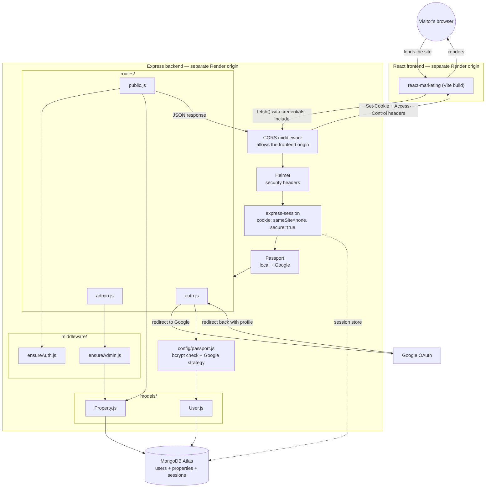

# Data Flow Diagram

How a request moves through the deployed project: two separate websites (React frontend, Express backend), Google, and MongoDB.

## Reading it left to right (or top to bottom)
1. **Browser** loads the React app from its own Render URL (the frontend origin).
2. React calls the backend's API with `fetch(..., { credentials: "include" })` — this is a **cross-origin** request because the frontend and backend are two different websites.
3. **CORS middleware** must explicitly allow the frontend's origin, or the browser blocks the response before React ever sees it.
4. **Helmet** adds security headers, **`express-session`** attaches the session cookie, **Passport** checks who's logged in.
5. Because the cookie has to survive a cross-origin `fetch()`, it's set with `sameSite: "none"` and `secure: true` in production. `sameSite: "lax"` would silently drop the cookie on these background requests and make it look like login "doesn't work."
6. **`routes/`** — `auth.js` (login/logout/session/Google), `public.js` (properties, reviews), `admin.js` (protected admin actions).
7. **`middleware/`** — `ensureAuth.js` and `ensureAdmin.js` gate the protected routes before they touch any data.
8. **Google OAuth** — `auth.js` redirects to Google, Google redirects back with the user's profile, and `config/passport.js` decides whether to create or reuse a `User` document.
9. **`models/`** talk to **MongoDB Atlas**, which also stores the session data itself (via `connect-mongo`) so sessions survive a server restart.
10. The response travels back through CORS (which adds `Access-Control-Allow-Origin` and `Set-Cookie`) to the React app, which renders the result for the visitor.

5. **`config/passport.js`** — for login routes, this decides if a username/password (bcrypt check) or a Google account is valid.
6. **`models/`** — routes talk to `User.js` or `Property.js` to read or write data.
7. **MongoDB** — the actual database that stores users and properties.
8. The response (JSON for the API, or a rendered EJS page) travels back the same path to the browser.
