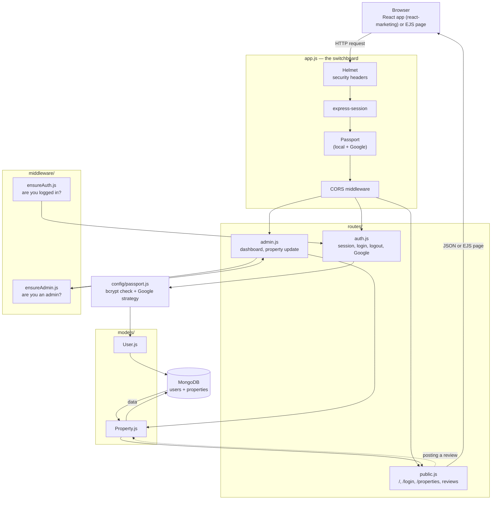

# Data Flow Diagram

How a request moves through the project, from the browser down to MongoDB.

## Reading it left to right (or top to bottom)
1. **Browser** — the React app or the plain EJS page sends a request (login, view properties, post a review, admin edit, etc.).
2. **`app.js`** — every request passes through Helmet (security headers), sessions, Passport, and CORS before reaching any route.
3. **`routes/`** — the request lands in `auth.js`, `public.js`, or `admin.js` depending on the URL.
4. **`middleware/`** — `admin.js` routes first check `ensureAdmin.js` ("are you an admin?"); other protected routes use `ensureAuth.js` ("are you logged in?").
5. **`config/passport.js`** — for login routes, this decides if a username/password (bcrypt check) or a Google account is valid.
6. **`models/`** — routes talk to `User.js` or `Property.js` to read or write data.
7. **MongoDB** — the actual database that stores users and properties.
8. The response (JSON for the API, or a rendered EJS page) travels back the same path to the browser.
